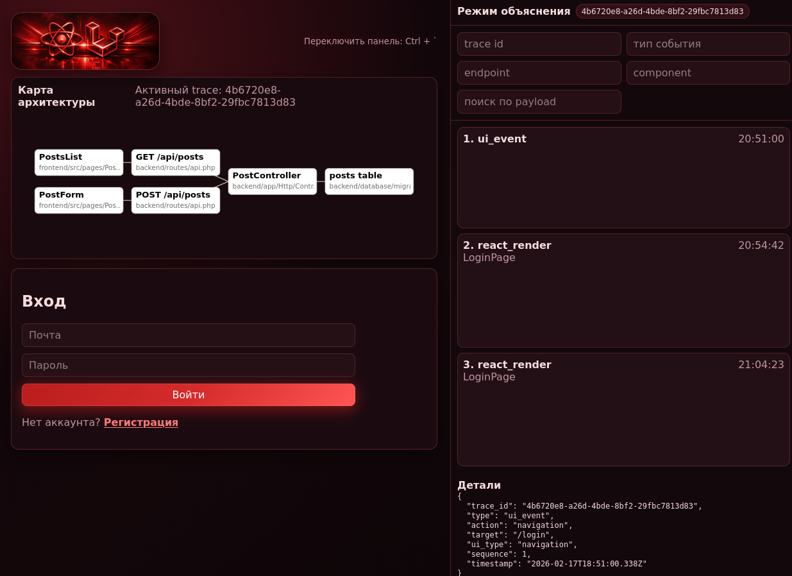

# Trace Sandbox Monorepo (React + Laravel)

Самообъясняющееся fullstack-приложение для демонстрации базовых сценариев (Auth + CRUD) и одновременной визуализации того, как действие пользователя проходит через весь стек:

`UI событие -> API -> Laravel route/controller -> SQL -> response -> state -> React render`

## О проекте

Проект состоит из двух частей:
- `frontend` — React + Vite + TypeScript
- `backend` — Laravel 11 API + SQLite + tracing + SSE

Приложение включает:
- Sandbox App:
1. Аутентификация (регистрация, вход, выход, `me`)
2. CRUD для постов (`title`, `body`, `status`)
3. Поиск, фильтр по статусу, пагинация
- Explain Mode (панель справа):
1. Лента событий трассировки
2. Детали выбранного события
3. Фильтры по trace id / type / endpoint / component / payload
- Architecture Map:
1. Узлы фронтенда, API, контроллеров и таблиц
2. Подсветка активных узлов по текущему trace

## Технологии

- Frontend: React 18, Vite, TypeScript, axios, zustand, react-router
- Backend: Laravel 11, PHP 8.2+, SQLite
- Dev: concurrently

## Структура репозитория

```text
.
├── backend
│   ├── app
│   ├── config
│   ├── database
│   └── routes
├── frontend
│   ├── src
│   └── vite.config.ts
├── package.json
└── README.md
```

## Как устроена трассировка

### Единый `trace_id`
- На фронтенде новый `trace_id` стартует при user action (`startTrace`)
- Во все API-запросы добавляется заголовок `X-Trace-Id`
- На backend `TraceContext` использует переданный `trace_id` или генерирует новый

### События фронтенда
- `ui_event`
- `api_request`
- `api_response`
- `react_render` (через React Profiler)

### События backend
- `request_received`
- `query_executed`
- `response_sent`
- `error`

### Транспорт
- MVP: summary в API response (`_trace`) + `X-Trace-Id`/`X-Trace-Summary`
- Step 2: SSE `GET /api/trace/stream?trace_id=...`

## API эндпоинты

- `POST /api/auth/register`
- `POST /api/auth/login`
- `POST /api/auth/logout`
- `GET /api/auth/me`
- `GET /api/posts`
- `POST /api/posts`
- `GET /api/posts/{id}`
- `PUT /api/posts/{id}`
- `DELETE /api/posts/{id}`
- `GET /api/trace/{id}`
- `GET /api/trace/stream?trace_id=...`

## Локальный запуск

Требования:
- PHP 8.2+
- Composer 2+
- Node.js 20+

1. Установить зависимости:
```bash
composer install --working-dir=backend
npm install --prefix frontend
npm install
```

2. Настроить окружение и БД:
```bash
cp backend/.env.example backend/.env
php -r "file_exists('backend/database/database.sqlite') || touch('backend/database/database.sqlite');"
php backend/artisan key:generate
php backend/artisan migrate
```

3. Запустить frontend + backend одной командой:
```bash
npm run dev
```

По умолчанию SSE-трассировка отключена на frontend (чтобы не блокировать запросы на встроенном `php -S`).
Для включения создайте `frontend/.env` с:
```bash
VITE_TRACE_SSE_ENABLED=true
```

После запуска:
- Frontend: `http://localhost:5173`
- Backend: `http://127.0.0.1:8000`

## Где смотреть ключевую реализацию

Frontend:
- `frontend/src/features/trace/store.ts`
- `frontend/src/features/trace/actions.ts`
- `frontend/src/features/trace/sse.ts`
- `frontend/src/api/client.ts`
- `frontend/src/components/TraceDevTools.tsx`
- `frontend/src/components/ArchitectureMap.tsx`

Backend:
- `backend/app/Http/Middleware/TraceContext.php`
- `backend/app/Providers/AppServiceProvider.php`
- `backend/app/Services/TraceStore.php`
- `backend/app/Http/Controllers/TraceController.php`
- `backend/routes/api.php`

## Документация по использованию интерфейса

Пошаговая инструкция для пользователя: `USER_MANUAL.md`

## Скриншот

Пример внешнего вида приложения:


